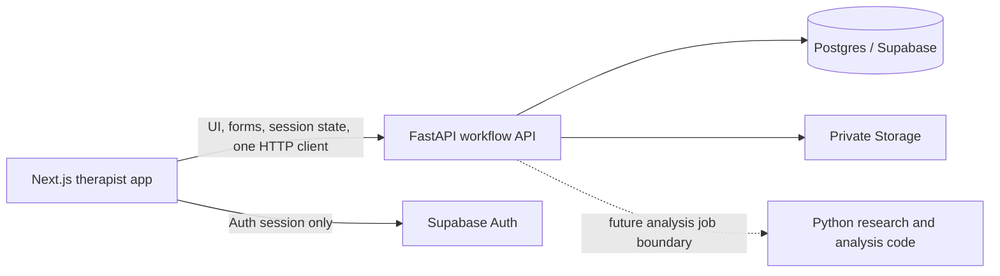

# LinguaLens Architecture Boundaries

Status: current maintained architecture, v1.6.3

This document describes the smallest boundary that matches the code currently
in the repository. It is intentionally not a plan for multiple services.

## Current product flow

### Next.js application

`apps/lingualens-app/` owns the browser-facing product surface:

- UI, routing, navigation, and responsive behavior;
- browser authentication/session integration and MFA gating;
- React Hook Form/Zod validation at the form boundary;
- workflow orchestration and display of API results;
- one HTTP client boundary in `src/lib/api.ts`.

The browser does not read clinical tables directly, create ML results, or
finalize reports. It may use Supabase Auth and consume short-lived signed URLs
issued by the API.

### FastAPI workflow API

`apps/api/` is the current authoritative clinical policy boundary. This is
explicitly frozen by ADR 0015 while the product is still using the existing
FastAPI workflow API. It owns:

- authenticated clinical CRUD and authorization checks;
- consent, tenant, care-team, audit, and report-safety rules;
- upload-intent orchestration and signed URL mediation;
- lightweight workflow jobs and current provider orchestration.

New product endpoints belong here, not in `src/therapist_backend/` or
`src/clinical_workflow/`, which remain legacy/research compatibility surfaces.

### Supabase

Supabase is the managed backing platform for the eventual production path:

- PostgreSQL for persisted records;
- Auth for user sessions and MFA;
- private Storage for audio and other sensitive files.

Service-role credentials stay server-side. RLS is defense in depth; FastAPI
authorization remains required. Realtime is not part of the default boundary.

### Python analysis boundary

`src/`, `packages/`, and research scripts contain scientific computation such as
audio preprocessing, CHAT parsing, feature extraction, acoustic/prosody work,
and research evaluation. They are not a second product API and are not imported
by browser code.

The small `packages/analysis_contract/` module defines the future handoff shape:
opaque input/session references, pipeline and feature-schema versions, optional
model version, timestamp, feature values, warnings, and explicit abstention
states. It has no FastAPI, database, auth, or storage dependency and is not
wired into the current workflow yet.

The current Python layer is local/CI research tooling. It is not deployed as a
separate production service today. If heavy processing later exceeds the API
runtime budget, introduce one small analysis service behind FastAPI with an
explicit job payload and result schema. Do not split it into audio, transcript,
feature, ML, and report microservices.

Every future persisted analysis result should carry explicit provenance fields:

- `pipeline_version`;
- `feature_schema_version`;
- `model_version` when a model is used;
- analysis timestamp and input/session reference.

No new ML model, queue platform, vector database, or analysis microservice is
required by the current application.

## Deployment posture

| Surface | Current posture | Boundary rule |
| --- | --- | --- |
| Next.js app | Standard `next build` is the Vercel contract; OpenNext/Cloudflare is an explicit staging path | Keep heavy audio/ML work out of edge/serverless functions |
| FastAPI API | Separate Python runtime/service | Keep clinical policy, CRUD, storage mediation, and jobs here |
| Supabase | Managed Postgres/Auth/private Storage target | Never expose service-role keys to the browser |
| Python research | Local/CI only today | Add one analysis boundary only when real workload requires it |

The progression for asynchronous scientific work is deliberately incremental:

1. synchronous execution while runtime is acceptable;
2. a database-backed `analysis_jobs` record and one worker when needed;
3. a dedicated queue only after measured workload proves the database-backed
   approach insufficient.

The legacy API worker has two concrete queue adapters: in-memory for local
tests/demo runs and Redis for a managed worker deployment. Capture V2 is a
separate database-backed worker: it claims `processing_runs` directly with
row-level locking and does not use the legacy Redis contract. A dedicated
Capture V2 queue adapter can be added only after its enqueue, lease, retry, and
acknowledgement semantics are implemented and tested.
