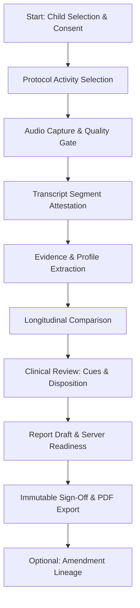

# LinguaLens Therapist End-to-End Walkthrough Guide

**Document Version:** 2.0 (Assessment V2 V1 Deliverable)  
**Date:** 2026-09-12  
**Target Audience:** Clinical Speech-Language Therapists, Clinical Supervisors, Usability Observers  
**Clinical Safety Boundary:** LinguaLens is an educational and research decision-support tool. It **does not provide automated ASD diagnoses** or calculate autism probability scores. All final dispositions, conclusions, and follow-up plans are strictly authored and signed by licensed clinicians.

---

## 1. Overview of the 7 Synthetic Walkthrough Scenarios

To ensure comprehensive validation of the clinical workflow, seven distinct synthetic patient scenarios have been prepared. All cases use strictly de-identified synthetic identifiers (`LL-0001` through `LL-0007`) and simulated audio/text samples.

---

## Scenario Walkthrough Cards

### Scenario 1: Normal Developmental Progression (Initial $\to$ Follow-up)
- **Synthetic Child:** `LL-0001` (Age: 36 mos $\to$ 42 mos, Thai primary language).
- **Clinical Context:** Child attending 6-month developmental follow-up after speech-language stimulation.
- **Workflow Steps:**
  1. **Capture:** Guided free play (15 mins) using protocol `thai_guided_language_sample:v0`.
  2. **Quality Gate:** Passes with loudness $-18.2$ dBFS, SNR $14.5$ dB, usable child turns ($N=48$).
  3. **Attestation:** Therapist reviews segments; confirms child vocalization boundaries.
  4. **Evidence Profile:** MLUw increases from $2.1 \to 3.4$ words/utterance; vocabulary expands by $+45$ distinct words.
  5. **Longitudinal Comparison:** Status shows `H14-Compatible`. Absolute deltas displayed with `+` signs and explicit morpheme units.
  6. **Clinical Review:** Zero attention cues triggered. Disposition selected: `within_normal_expectations`.
  7. **Sign-Off & Export:** Server readiness passes instantly. Report signed with SHA-256 snapshot and exported as bilingual Thai/English PDF.

---

### Scenario 2: Sparse / Limited Evidence (Short Speech Turn Count)
- **Synthetic Child:** `LL-0002` (Age: 28 mos).
- **Clinical Context:** Child was reserved, producing only 6 brief vocalizations during the observation window.
- **Workflow Steps:**
  1. **Capture:** 10-minute session yields limited audio.
  2. **Quality Gate:** Flagged as `needs_additional_sample` due to child turn count $< 10$.
  3. **Evidence Profile:** Features `mluw`, `ttr`, and `echolalia_ratio` explicitly display `insufficient_data` rather than imputed zeros or misleading low scores.
  4. **Omission Disclosure:** System surfaces an explicit limitation notice: *"Sample duration and turn volume insufficient for statistical representation."*
  5. **Review Action:** Attention cue `acoustic_signal_unstable` triggers. Therapist selects `more_evidence_requested` with clinical rationale: *"Child was hesitant in clinic setting. Scheduling repeat home recording sample."*
  6. **Sign-Off Barrier:** Sign-off button remains locked until disposition acknowledges the limited-evidence path without claiming complete developmental staging.

---

### Scenario 3: Conflicting Attention Cues (High Lexical Diversity vs Low Turn-Taking)
- **Synthetic Child:** `LL-0003` (Age: 40 mos).
- **Clinical Context:** Child exhibits advanced expressive vocabulary but minimal reciprocal conversational engagement.
- **Workflow Steps:**
  1. **Evidence Profile:** High vocabulary size ($112$ distinct words, TTR $0.62$), but `child_adult_turn_ratio` is $0.18$ and `turn_taking_count` is 2.
  2. **Attention Cues Evaluated:**
     - Cue A: `turn_taking_low` (Significant severity)
     - Cue B: `social_affect_low` (Moderate severity)
     - Cue C: `vocabulary_size` (Within normal reference band)
  3. **Non-Exclusive Representation:** Both strengths and areas of concern are displayed independently. No composite "risk percentage" is calculated.
  4. **Therapist Deliberation:**
     - Therapist **acknowledges** Cue A: *"Matches clinic observation of monologue-heavy speech."*
     - Therapist **disagrees** with Cue B, providing required rationale: *"Child exhibited rich non-verbal shared eye contact during block-building, mitigating automated audio affect flag."*
  5. **Outcome:** Clinician-authored disposition is saved with custom follow-up targeted at reciprocal play.

---

### Scenario 4: Incompatible Longitudinal Follow-Up (Protocol & Language Mismatch)
- **Synthetic Child:** `LL-0004` (Age: 44 mos).
- **Clinical Context:** Comparing a baseline conducted under a bilingual protocol with a follow-up conducted under standard Thai guided play.
- **Workflow Steps:**
  1. **Comparison Selector:** Therapist selects Baseline Visit 1 (`elicitation_protocol_v1`, bilingual en/th) against Current Visit 2 (`thai_guided_language_sample:v0`, Thai-only).
  2. **System Guard:** Engine blocks numerical delta calculation and renders frame `H14-Incompatible`.
  3. **Incompatibility Badges:** Each feature displays explicit rationale: `protocol_incompatible` and `language_mismatch`.
  4. **Safety Verification:** The system prevents the therapist from generating automated "improved" or "regressed" labels across mismatched conditions.

---

### Scenario 5: Consent Withdrawal Mid-Workflow (Immediate Fail-Closed Denial)
- **Synthetic Child:** `LL-0005` (Age: 32 mos).
- **Clinical Context:** Parent contacts clinic to withdraw research and clinical data processing consent after audio recording.
- **Workflow Steps:**
  1. **Supervisor Action:** Caregiver consent status is set to `withdrawn` via `/api/v2/children/{id}/consents/withdraw`.
  2. **Immediate Fail-Closed Probing:**
     - Therapist attempts to view transcript: returns `HTTP 409 consent_revoked`.
     - API blocks audio streaming and segment extraction immediately.
     - Report workspace disables draft generation and sign-off.
  3. **Verification Receipt:** Proves that consent withdrawal is enforced at the database transaction layer, overriding client cache.

---

### Scenario 6: Offline / Network Interruption & Worker Lease Recovery
- **Synthetic Child:** `LL-0006` (Age: 38 mos).
- **Clinical Context:** Clinical tablet loses connectivity during a multi-part audio upload.
- **Workflow Steps:**
  1. **Upload Interruption:** Network drops at byte offset 4,194,304 of 8,388,608.
  2. **Client Resumption:** Tablet reconnects; API verifies existing chunks and issues a resumed signed upload intent without restarting from byte 0.
  3. **Worker Timeout Simulation:** Background processing worker experiences artificial pod restart.
  4. **Lease Recovery:** Database `processing_runs` detects lease expiry ($> 300$s); secondary worker reclaims the job and completes evidence extraction.

---

### Scenario 7: Immutable Sign-Off, Authorized PDF Export & Amendment Lineage
- **Synthetic Child:** `LL-0007` (Age: 45 mos).
- **Clinical Context:** Initial signed report needs factual amendment following multidisciplinary team review.
- **Workflow Steps:**
  1. **Initial Sign-Off:** Assigned clinician signs Report `rep_007_v1`. Snapshot frozen with SHA-256 hash `d4e5f6...`.
  2. **Direct Edit Rejection:** Direct `PUT /reports/rep_007_v1` returns `HTTP 409 report_immutable`.
  3. **Amendment Creation:** Clinician clicks **"Create Amendment"**; provides required reason: *"Incorporated occupational therapy sensory processing observations."*
  4. **Lineage Audit:** System branches `rep_007_v2` (Sequence 1) linked to parent `rep_007_v1`. Both versions remain permanently auditable in the Lineage Timeline.
  5. **Export:** Authorized PDF export downloads with native Thai TrueType fonts, watermarked with immutable verification hashes.
