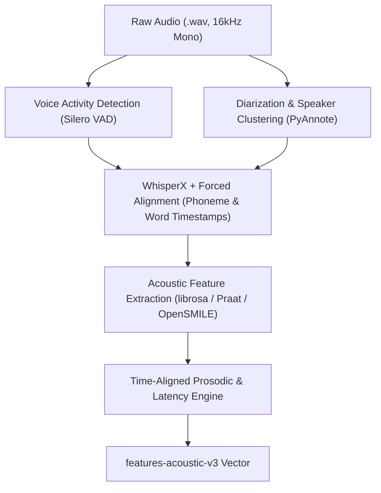

# LinguaLens Acoustic & Prosodic Feature Schema v3 Candidate Roadmap
**Generated Date:** 2026-08-23  
**Status:** Architectural Specification & Roadmap  
**Target Schema:** `features-acoustic-v3`  

---

## 1. Executive Summary & Rationale

Our empirical findings across Feature Schema v1 (`features-basic-v1`) and v2 (`features-conversation-v2`) establish that:
1. Retrospective lexical and morphological features show corpus-specific separation (corrected ASD vs DD Elastic-Net AUROC **0.7730**) but do not establish clinical validity or cross-site transportability.
2. Corrected text-only conversational features have mixed effects: Eigsti ASD vs TD changed from **0.6234** (v1) to **0.6089** (v1+v2), while cross-corpus results remain non-transportable. They also cannot measure millisecond timing or prosody without validated audio alignment.

**Feature Schema v3 (`features-acoustic-v3`)** is a prospective research specification. Its helper calculations are not integrated into the therapist API or UI and are not validated clinical measurements.

---

## 2. Candidate Acoustic & Prosodic Features

| Feature Name | Clinical / Construct Motivation | Extraction Method / Formula | Audio Requirements | Pre-requisite Alignment |
| :--- | :--- | :--- | :--- | :--- |
| **`response_latency_median_ms`** | Measures pragmatic processing and response timing in social interaction. | Median silence (ms) between adult turn offset ($t_{\text{end}}^{\text{ADULT}}$) and child turn onset ($t_{\text{start}}^{\text{CHI}}$). | High-quality stereo or diarized audio | Forced alignment / VAD boundaries |
| **`response_latency_iqr_ms`** | Captures latency variability and conversational unpredictability. | Interquartile range of turn transition latency ($Q_3 - Q_1$). | High-quality diarized audio | Turn boundary timestamps |
| **`pitch_f0_sd_semitones`** | Measures pitch variation within detected child speech. | Standard deviation of fundamental frequency (F0) converted to semitones relative to baseline. | Clean child vocal segments ($\text{SNR} > 15\text{ dB}$) | Parsed pitch track (CREPE / PRAAT) |
| **`pitch_range_90_10_semitones`** | Dynamic pitch excursion across declarative and interrogative turns. | 90th percentile F0 minus 10th percentile F0 in semitones. | Clean child vocal segments | Pitch extraction |
| **`articulation_rate_sps`** | Articulatory speed during continuous speech bursts. | Syllables produced divided by phonation time (excluding intra-utterance pauses $>200\text{ ms}$). | Continuous speech chunks | Syllable nucleus detection |
| **`pause_duration_ratio`** | Proportion of turn spent in silent hesitation or lexical search. | Total silent pause duration within turn / Total turn duration. | Clean recording | VAD silence detector |
| **`vowel_space_area`** | Formant dispersion and articulatory clarity (F1/F2 centralization). | Convex hull area of vowel formants ($/i/, /a/, /u/$) in Hertz/Bark. | Formant track on vowels | Phoneme-level forced alignment |
| **`prosodic_entrainment_f0`** | Acoustic coordination and reciprocity with the conversation partner. | Turn-by-turn correlation of mean F0 between consecutive adult and child turns. | Dual-speaker dialog | Diarized turn timestamps |

---

## 3. Data Requirements & Infrastructure Pipeline

### 3.1 Pipeline Components
1. **Audio Standardization:** Convert all audio inputs to 16 kHz, 16-bit mono PCM.
2. **Forced Alignment:** Evaluate WhisperX / Montreal Forced Aligner (MFA) as candidate providers; the $\pm 20\text{ ms}$ accuracy target is unverified until gold-timing evaluation.
3. **Acoustic Profiling:** Run deterministic Praat / OpenSMILE feature extractors for pitch tracking (F0), formant frequencies (F1, F2, F3), and jitter/shimmer.
4. **Interactive Alignment:** Compute conversational turn transitions by pairing adult audio offsets with subsequent child audio onsets.

---

## 4. Methodological Safeguards & Confounder Controls

1. **Recording Environment Normalization:**
   - Background noise and room reverberation vary dramatically across home vs clinic recordings.
   - All acoustic features must undergo SNR filtering ($\text{SNR} \ge 12\text{ dB}$) and cepstral mean variance normalization (CMVN) to prevent learning recording device artifacts.
2. **Microphone & Channel Confounder Audit:**
   - Train an auxiliary classifier to predict recording device / microphone type from acoustic features. Features with $>0.80$ device classification AUROC must be rejected or residualized.
3. **Age & Sex Covariate Residualization:**
   - Fundamental frequency (F0) decreases naturally with age and differs by biological sex. F0 metrics must be age/sex standardized against normative pediatric benchmarks.
4. **Clinical Safety & Research Integrity:**
   - Raw audio bytes and intermediate acoustic spectrum files must remain strictly within local encrypted storage and adhere to research consent gates.
